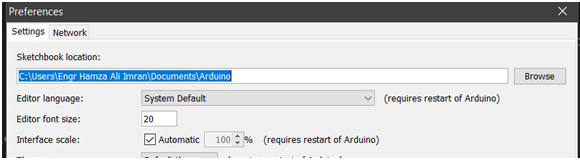
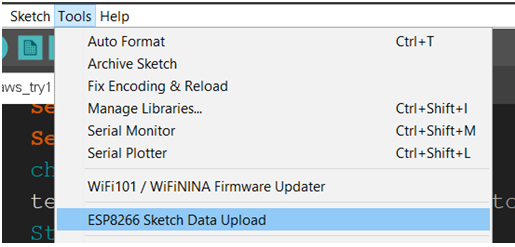

# NodeMCU AWS Subscription
In order to create a connection with AWS. We first need to flash certificates provided by AWS into NodeMCU's Flash memory.
# Installation of Drivers 
You need to install drivers for FTDI chip cp2101 present on NodeMCU. You can get them to form the following link
https://www.silabs.com/products/development-tools/software/usb-to-uart-bridge-vcp-drivers 

# Flashing the Certificates
Three certificate files are used to establish a connection with AWS Cloud. Following are the files
  - xxx-ca.pem
  - xxx-certificate.pem 
  - xxx-private.pem.key
## Conversion to DER Format 
To flash to NodeMCU, we need to convert the certificate files to DER format. The OpenSSL utility is used for this purpose. Next is the syntax for running conversion commands.
```sh
$ openssl  x590 -in InputFileName.pem –out OutputFileName.der -outform DER
```
Window users can use Ubuntu App from Microsoft Store for this. OpenSSL can be installed by running
```sh
apt install openssl
```
## ESP8266 FileSystem Uploader
To flash DER files, we need a to install plug-in named "ESP8266 FileSystem Uploader" to Arduino IDE. Following is the link to repository
https://github.com/esp8266/arduino-esp8266fs-plugin

Clone the above repository. Create a folder at sketchbook location of IDE and name it tools. You can find the path at Preferences submenu is inside File Menu. As shown below


Restart the Arduino IDE. Connect your NodeMCU with computer and select the COM port on Arduino IDE. Click on "ESP8266 Sketch Data Upload" inside the Tools Menu in Arduino IDE. As shown below.



It will start uploading certificates to NodeMCU. This may take upto 2 Minutes.  
